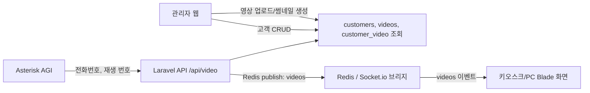
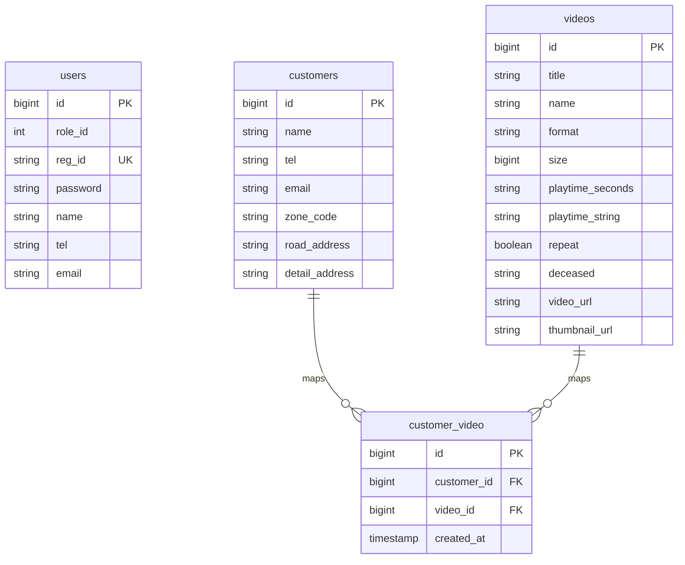

# 저장소 소스 분석 결과

## 1. 요약

이 저장소는 Laravel 9 기반의 **추모 영상 관리 및 전화 연동 재생 시스템(MVS)** 으로 분석됩니다. 관리자는 웹 화면에서 고객과 영상을 등록하고 고객별 영상을 매핑합니다. 재생 단말은 브라우저 기반 키오스크/PC 화면을 띄워 두고, Asterisk AGI에서 전달되는 전화 이벤트가 Laravel API와 Redis/Socket.io를 거쳐 해당 고객의 영상을 자동 재생합니다.

핵심 흐름은 다음과 같습니다.

## 2. 기술 스택

| 영역 | 사용 기술 | 주요 파일 |
| --- | --- | --- |
| 백엔드 | PHP 8.0+, Laravel 9 | `composer.json`, `app/`, `routes/` |
| 인증 | Laravel 세션 인증(Auth) | `app/Http/Controllers/AuthController.php` |
| 데이터베이스 | MySQL, 추가 관리 DB 연결 | `config/database.php`, `database/migrations/` |
| 실시간 전달 | Redis pub/sub, Socket.io 클라이언트 | `app/Http/Controllers/MvsController.php`, `resources/views/mvs/*.blade.php` |
| 미디어 처리 | getID3, FFmpeg, VideoThumbnail | `composer.json`, `Dockerfile`, `app/Http/Controllers/VideoController.php` |
| 프런트엔드 | Blade, Tailwind, SCSS, Vite, 일부 Vue 흔적 | `resources/views/`, `resources/js/`, `vite.config.js` |
| 배포 | Docker Compose, PHP-FPM, Nginx | `Dockerfile`, `docker-compose.yml`, `docker/nginx/default.conf` |
| 전화 연동 | Asterisk AGI / phpagi | `asterisk/` |

## 3. 디렉터리 구조

| 경로 | 역할 |
| --- | --- |
| `app/Http/Controllers/` | 웹/관리자/API 요청 처리 로직 |
| `app/Models/` | `User`, `Customer`, `Video` Eloquent 모델 |
| `routes/web.php` | 키오스크, 관리자, 고객/영상 CRUD 라우트 |
| `routes/api.php` | Asterisk AGI가 호출하는 `/api/video` 라우트 |
| `resources/views/` | Blade 기반 UI |
| `resources/js/`, `resources/scss/`, `resources/css/` | Vite 빌드 대상 프런트 자산 |
| `database/migrations/` | 핵심 테이블 스키마 |
| `database/seeders/` | 초기 데이터 시더 |
| `asterisk/` | Asterisk AGI 스크립트 및 phpagi 라이브러리 |
| `docker/`, `Dockerfile`, `docker-compose.yml` | 컨테이너 실행 환경 |
| `config/` | Laravel, DB, Redis, FFmpeg, SweetAlert 설정 |

## 4. 주요 기능 분석

### 4.1 키오스크/재생 화면

- `GET /` -> `MvsController@index`
- `GET /pc` -> `MvsController@pc`
- 주요 뷰:
  - `resources/views/mvs/index.blade.php`
  - `resources/views/mvs/pc.blade.php`

동작:

1. `MvsAuth::flag()`로 관리 DB의 서비스 플래그를 조회합니다.
2. `SOCKET_HOST` 또는 하드코딩 IP를 통해 Socket.io 서버 연결을 시도합니다.
3. `videos` 이벤트를 수신하면 전달받은 고객/영상 JSON을 파싱합니다.
4. 영상이 1개면 즉시 재생하고, 여러 개면 선택 UI를 표시합니다.
5. 수동으로 전화번호를 입력하면 `GET /video?tel=...`로 영상 목록을 조회할 수 있습니다.

주의할 점:

- `resources/views/mvs/index.blade.php`에는 `192.168.94.101:6001`이 하드코딩되어 있습니다.
- `resources/views/mvs/pc.blade.php`는 스크립트 로딩에 `{{ env('SOCKET_HOST') }}`를 쓰지만 실제 `io.connect()`에는 `192.168.94.101`이 남아 있습니다.
- 두 Blade 파일에 유사한 JavaScript 로직이 중복되어 있습니다.

### 4.2 Asterisk 전화 연동

주요 파일:

- `asterisk/mvs_GetUserInform.php`
- `asterisk/mvs_GetVideosInform.php`
- `asterisk/phpagi.php`

동작:

1. AGI 스크립트가 발신자 번호(`agi_callerid`)를 읽습니다.
2. 직접 MySQL에 접속해 고객과 고객-영상 매핑을 확인합니다.
3. 영상이 있으면 Laravel API `http://192.168.94.101:8100/api/video`를 호출합니다.
4. 영상이 여러 개인 경우 AGI 변수 `COUNT`를 설정하고, 이후 선택 번호를 `play` 파라미터로 전달하는 흐름이 있습니다.

주의할 점:

- AGI 스크립트에 내부 IP와 포트가 하드코딩되어 있습니다.
- Laravel과 별도로 MySQL을 직접 조회하므로 데이터 접근 로직이 이중화되어 있습니다.

### 4.3 API와 실시간 이벤트

주요 파일:

- `routes/api.php`
- `app/Http/Controllers/MvsController.php`

`GET /api/video`는 `MvsController@receive`로 연결됩니다.

처리 흐름:

1. `tel` 파라미터를 확인합니다.
2. `customers.tel`로 고객을 조회합니다.
3. 고객을 찾지 못하면 `01000000000` 전화번호의 기본 고객으로 대체합니다.
4. `customer_video`와 `videos`를 조인하여 영상 목록을 조회합니다.
5. `play` 파라미터가 있고 영상이 여러 개면 해당 인덱스의 영상만 선택합니다.
6. 결과를 Redis `videos` 채널에 publish합니다.

관련 코드:

- Redis publish: `Redis::publish('videos', json_encode($rs));`
- 조회용 JSON API: `GET /video` -> `MvsController@retrieve`

주의할 점:

- `/api/video`는 인증/서명 검증 없이 전화번호와 선택 번호만으로 실시간 재생 이벤트를 발생시킵니다.
- `receive()`는 응답을 명시적으로 반환하지 않고 Redis publish 후 종료합니다.
- `receive()`와 `retrieve()`의 미등록 전화번호 처리 방식이 다릅니다. `receive()`는 기본 고객으로 fallback하고, `retrieve()`는 예외를 반환합니다.

### 4.4 관리자 인증

주요 파일:

- `routes/web.php`
- `app/Http/Controllers/AuthController.php`
- `app/Models/User.php`

기능:

- `GET /login`: 로그인 화면
- `POST /login`: `reg_id`, `password`로 `Auth::attempt()`
- `POST /logout`: 세션 종료
- `POST /find`: 동적 테이블 조회 API

주의할 점:

- `routes/web.php`의 `/customers`, `/videos`, `/dashboard`, `/users` 등에 `auth` 미들웨어가 적용되어 있지 않습니다.
- 컨트롤러에서 `Auth::user()`를 사용하지만, 라우트 보호가 없어 비로그인 접근 시 null 상태가 될 수 있습니다.
- `POST /find`는 요청으로 받은 `table`, `select`, `value`를 그대로 DB 쿼리에 사용합니다.

### 4.5 고객 관리

주요 파일:

- `app/Http/Controllers/CustomerController.php`
- `app/Models/Customer.php`
- `resources/views/customers/`

기능:

- 고객 목록/검색: `GET /customers`
- 고객 등록: `POST /customers`
- 고객 수정: `PATCH /customers/{id}`
- 고객 삭제: `DELETE /customers/{id}`
- 고객별 영상 매핑: `GET /customers/{id}/video`, `POST /customers/video`, `DELETE /customers/video/{id}`
- 고객 상세: `GET /customers/{id}/view`

데이터 특징:

- 고객 전화번호는 등록 시 `unique:customers`로 검증합니다.
- 고객-영상 관계는 Eloquent 관계 메서드 없이 `DB::table('customer_video')` raw query로 처리합니다.
- 주소 입력은 Daum Postcode 스크립트를 사용하는 것으로 보입니다.

주의할 점:

- 검색 필드 `$sfl`을 요청에서 받아 `Customer::where($sfl, ...)`에 직접 사용합니다.
- `use Cassandra\Custom;`는 실제 사용되지 않는 import입니다.

### 4.6 영상 관리

주요 파일:

- `app/Http/Controllers/VideoController.php`
- `app/Models/Video.php`
- `resources/views/videos/`

기능:

- 영상 목록/검색: `GET /videos`
- 영상 업로드/등록: `POST /videos`
- 영상 수정: `PATCH /videos/{id}`
- 영상 삭제: `DELETE /videos/{id}`

업로드 처리 흐름:

1. 업로드 파일을 `public/mvs/`에 저장합니다.
2. getID3로 해상도, 재생 시간, 파일 정보를 분석합니다.
3. 가로/세로 해상도 비교로 화면 모드(`mode`)를 결정합니다.
4. `public/thumbnail/`에 썸네일을 생성합니다.
5. 로컬 `videos` 테이블에 저장합니다.
6. `mysql_management` 연결의 `mvs_video` 테이블에도 일부 정보를 insert합니다.

주의할 점:

- 수정/삭제 시 `mysql_management.mvs_video`와의 동기화 로직은 보이지 않습니다.
- 업로드 파일 검증이 필수 여부 중심이며, MIME/확장자/용량 정책은 명확하지 않습니다.
- 검색 필드 `$sfl`이 요청값 그대로 컬럼명으로 사용됩니다.
- `use function Webmozart\Assert\Tests\StaticAnalysis\boolean;`는 실제 사용되지 않는 import입니다.

## 5. 라우트 요약

### 5.1 Web 라우트 (`routes/web.php`)

| Method | Path | Controller | 역할 |
| --- | --- | --- | --- |
| GET | `/` | `MvsController@index` | 키오스크 재생 화면 |
| GET | `/pc` | `MvsController@pc` | PC 재생 화면 |
| GET | `/login` | `AuthController@index` | 로그인 화면 |
| POST | `/login` | `AuthController@login` | 로그인 처리 |
| POST | `/logout` | `AuthController@logout` | 로그아웃 |
| POST | `/find` | `AuthController@find` | 동적 DB 조회 |
| GET/POST | `/users`, `/users/create` | `UserController` | 사용자 등록 관련 |
| GET/POST/PATCH/DELETE | `/customers...` | `CustomerController` | 고객 CRUD |
| GET/POST/DELETE | `/customers/.../video` | `CustomerController` | 고객-영상 매핑 |
| GET | `/dashboard` | `MvsController@dashboard` | 관리자 대시보드 |
| GET | `/video` | `MvsController@retrieve` | 전화번호 기반 영상 JSON 조회 |
| GET | `/flag` | `MvsController@flag` | 라우트는 있으나 메서드 없음 |
| GET/POST/PATCH/DELETE | `/videos...` | `VideoController` | 영상 CRUD |
| GET | `/phpinfo` | `MvsController@phpInfo` | PHP 정보 출력 |

### 5.2 API 라우트 (`routes/api.php`)

| Method | Path | Controller | 역할 |
| --- | --- | --- | --- |
| GET | `/api/video` | `MvsController@receive` | Asterisk 이벤트 수신 및 Redis publish |

## 6. 데이터 모델

### 6.1 엔티티 관계

### 6.2 마이그레이션

| 테이블 | 파일 | 설명 |
| --- | --- | --- |
| `users` | `database/migrations/2014_10_12_000000_create_users_table.php` | 관리자/사용자 계정 |
| `videos` | `database/migrations/2023_01_19_211656_create_videos_table.php` | 영상 메타데이터와 저장 경로 |
| `customers` | `database/migrations/2023_01_29_035011_create_customers_table.php` | 고객, 전화번호, 주소 정보 |
| `customer_video` | `database/migrations/2023_02_03_011020_create_customer_video_table.php` | 고객-영상 매핑 pivot |

### 6.3 모델

| 모델 | 파일 | 특징 |
| --- | --- | --- |
| `User` | `app/Models/User.php` | Laravel 인증 모델, `reg_id` 사용 |
| `Customer` | `app/Models/Customer.php` | `$guarded = []`, 관계 메서드 없음 |
| `Video` | `app/Models/Video.php` | `$guarded = []`, 관계 메서드 없음 |

주의할 점:

- `customers` 마이그레이션의 컬럼 comment가 실제 의미와 어긋난 부분이 있습니다. 예: `name` comment가 `고객등급`, `tel` comment가 `고객명`으로 되어 있습니다.
- `customer_video`는 `updated_at` 없이 `created_at`만 둡니다.
- 다대다 관계가 명확하지만 Eloquent `belongsToMany` 관계는 정의되어 있지 않습니다.

## 7. 외부 시스템 및 설정

### 7.1 MySQL / 관리 DB

`config/database.php`에는 기본 `mysql` 외에 `mysql_management` 연결이 있습니다.

사용처:

- `MvsAuth::flag()`: `mysql_management.flag` 조회
- `VideoController::store()`: `mysql_management.mvs_video` insert

주의할 점:

- `mysql_management` 관련 테이블의 마이그레이션은 저장소에 없습니다.
- 관리 DB 장애 시 서비스 플래그 조회 및 영상 등록 흐름에 영향을 줄 수 있습니다.

### 7.2 Redis / Socket.io

Laravel은 `predis/predis`를 사용하며 `MvsController@receive`에서 Redis 채널 `videos`로 publish합니다. 저장소 안에는 Redis를 구독해서 Socket.io로 전달하는 서버 구현이 확인되지 않았으므로 별도 프로세스/서비스가 필요합니다.

### 7.3 FFmpeg / 썸네일

- `Dockerfile`에서 `ffmpeg`를 설치합니다.
- `VideoController@store`에서 `Pawlox\VideoThumbnail\Facade\VideoThumbnail`로 썸네일을 생성합니다.
- getID3로 영상 해상도와 재생 시간을 분석합니다.

### 7.4 SweetAlert

- `realrashid/sweet-alert` 패키지 사용
- 설정 파일: `config/sweetalert.php`
- Blade include: `resources/views/vendor/sweetalert/alert.blade.php`

## 8. 프런트엔드 분석

### 8.1 Vite

`vite.config.js`의 빌드 입력:

- `resources/css/app.css`
- `resources/scss/app.scss`
- `resources/js/app.js`

Vue 플러그인은 주석 처리되어 있습니다.

### 8.2 JavaScript / Vue

`resources/js/app.js`에는 Vue 앱 초기화 코드가 대부분 주석 처리되어 있습니다. `resources/js/components/`와 `resources/js/router/index.js`에는 Vue 3 기반 구성 흔적이 있지만 현재 핵심 화면은 Blade 내부 스크립트로 동작합니다.

### 8.3 Blade 화면

| 경로 | 역할 |
| --- | --- |
| `resources/views/mvs/` | 키오스크/PC/대시보드 |
| `resources/views/customers/` | 고객 목록, 등록, 수정, 상세, 영상 매핑 |
| `resources/views/videos/` | 영상 목록, 등록, 수정 |
| `resources/views/auth/` | 로그인/회원가입 |
| `resources/views/layouts/` | 관리자/재생 화면 레이아웃 |

## 9. 배포와 실행 환경

### 9.1 Docker

`docker-compose.yml` 구성:

- `mvs`: 애플리케이션 컨테이너, `Dockerfile` 빌드, `/var/www` 마운트
- `nginx`: `nginx:stable-alpine`, 8100 포트 노출
- 외부 네트워크: `nginx-proxy`

`Dockerfile` 주요 구성:

- Base image: `php:8.1-fpm`
- PHP 확장: `pdo_mysql`, `mbstring`, `exif`, `pcntl`, `bcmath`, `gd`
- 시스템 패키지: `ffmpeg`, 이미지 처리 도구, Git, curl 등
- Node.js 16 설치
- Composer 복사

### 9.2 테스트

테스트 파일:

- `tests/Feature/ExampleTest.php`
- `tests/Unit/ExampleTest.php`

현재 도메인 기능을 검증하는 테스트는 거의 없고 Laravel 기본 예제 수준입니다.

## 10. 주요 리스크 및 개선 포인트

### 10.1 보안

1. **관리 라우트 인증 미적용**
   - `routes/web.php`의 `/dashboard`, `/customers`, `/videos`, `/users` 라우트에 `auth` 미들웨어 그룹이 없습니다.
   - URL을 아는 사용자가 관리 기능에 접근할 수 있는 구조입니다.

2. **동적 DB 조회 위험**
   - `AuthController@find`가 요청값의 `table`, `select`, `value`를 그대로 `DB::table(...)->select(...)->where(...)`에 사용합니다.
   - 허용 목록 기반 검증이 필요합니다.

3. **검색 컬럼명 검증 부족**
   - `CustomerController@index`, `CustomerController@video`, `VideoController@index`에서 `$sfl`을 요청에서 받아 컬럼명으로 사용합니다.
   - 검색 가능 컬럼을 화이트리스트로 제한하는 것이 안전합니다.

4. **공개 phpinfo**
   - `GET /phpinfo`가 `phpinfo()`를 직접 출력합니다.
   - 운영 환경에서는 제거하거나 강한 접근 제어가 필요합니다.

5. **API 인증/서명 없음**
   - `GET /api/video`는 전화번호만으로 Redis 재생 이벤트를 발생시킵니다.
   - AGI 호출자 검증, 서명, 내부망 제한 등 보호 장치가 필요합니다.

6. **민감 설정 파일 관리 필요**
   - 저장소에 `.env.production`, `.env.temple`, `.env.window`, `.env_20250720` 등 환경 파일이 존재합니다.
   - 실제 비밀값이 포함되어 있다면 즉시 회전 및 저장소 정리가 필요합니다.

### 10.2 기능 안정성

1. **깨진 라우트**
   - `routes/web.php`에는 `MvsController@flag` 라우트가 있지만 `MvsController`에는 `flag()` 메서드가 없습니다.
   - 실제 flag 조회는 `MvsAuth::flag()`에 있습니다.

2. **미정의 메서드 호출**
   - `UserController`의 일부 메서드는 `AuthController::authCheck()`를 호출하지만 `AuthController`에는 해당 메서드가 없습니다.

3. **서비스 플래그 null 처리 부족**
   - `MvsAuth::flag()`는 `mysql_management.flag` 조회 결과가 없을 때 `$query->flag`에 접근할 수 있습니다.

4. **관리 DB 동기화 불완전**
   - 영상 등록 시 `mysql_management.mvs_video`에 insert하지만 수정/삭제 동기화는 보이지 않습니다.

5. **미등록 전화번호 처리 불일치**
   - `receive()`는 기본 고객 `01000000000`으로 대체하고, `retrieve()`는 오류를 반환합니다.

### 10.3 유지보수성

1. **Blade 내 JavaScript 중복**
   - `mvs/index.blade.php`와 `mvs/pc.blade.php`에 거의 같은 재생/Socket/조회 로직이 있습니다.

2. **하드코딩된 IP/포트**
   - AGI 스크립트와 Blade 스크립트에 `192.168.94.101`, `8100`, `6001` 등이 남아 있습니다.

3. **Eloquent 관계 부재**
   - 고객-영상 관계를 모델 관계로 정의하면 중복 join과 raw query를 줄일 수 있습니다.

4. **미사용 코드와 import**
   - Vue 초기화, 이벤트 브로드캐스트, 일부 import가 미완/미사용 상태입니다.

5. **테스트 부족**
   - 영상 업로드, 썸네일 생성, 고객-영상 매핑, `/api/video` Redis publish, 인증 보호에 대한 테스트가 없습니다.

## 11. 개선 권장 순서

1. **접근 제어 정비**
   - 관리자 라우트를 `auth` 미들웨어로 묶고, `/phpinfo` 제거 또는 보호.

2. **외부 호출 보호**
   - `/api/video`에 내부망 제한, 토큰, 서명 등 호출자 검증 추가.

3. **동적 쿼리 제거**
   - `/find`, 검색 필드 `$sfl`에 화이트리스트 적용.

4. **환경값 정리**
   - IP/포트를 `.env`로 통일하고, 저장소 내 환경 파일의 비밀값 제거 및 회전.

5. **도메인 모델 정리**
   - `Customer`와 `Video`에 `belongsToMany` 관계 정의.
   - `customer_video` 접근 로직을 서비스/모델 계층으로 이동.

6. **실시간 구조 명문화**
   - Redis를 Socket.io로 브리지하는 별도 서버의 배포/운영 위치를 문서화하거나 저장소에 포함.

7. **테스트 추가**
   - 고객/영상 CRUD, 영상 업로드, `/video`, `/api/video`, 권한 보호에 대한 Feature 테스트 추가.

## 12. 핵심 파일 목록

| 파일 | 중요도 | 설명 |
| --- | --- | --- |
| `routes/web.php` | 높음 | 웹 진입점과 관리자/재생 라우트 |
| `routes/api.php` | 높음 | AGI 이벤트 수신 API |
| `app/Http/Controllers/MvsController.php` | 높음 | 재생 화면, 영상 조회, Redis publish |
| `app/Http/Controllers/CustomerController.php` | 높음 | 고객 CRUD와 고객-영상 매핑 |
| `app/Http/Controllers/VideoController.php` | 높음 | 영상 업로드, 썸네일, DB 저장 |
| `app/Http/Controllers/AuthController.php` | 높음 | 로그인과 동적 조회 API |
| `app/Http/Controllers/MvsAuth.php` | 중간 | 서비스 플래그, 카운트 조회 |
| `database/migrations/*.php` | 높음 | 핵심 스키마 |
| `resources/views/mvs/index.blade.php` | 높음 | 키오스크 재생 UI |
| `resources/views/mvs/pc.blade.php` | 높음 | PC 재생 UI |
| `asterisk/mvs_GetUserInform.php` | 높음 | 전화 이벤트와 Laravel API 연결 |
| `asterisk/mvs_GetVideosInform.php` | 높음 | 선택 번호 기반 영상 재생 요청 |
| `config/database.php` | 중간 | 기본 DB, 관리 DB, Redis 설정 |
| `Dockerfile` | 중간 | PHP/FFmpeg/Node 실행 환경 |
| `docker-compose.yml` | 중간 | 컨테이너 구성 |
| `vite.config.js` | 낮음 | 프런트 빌드 입력 |

## 13. 결론

이 저장소의 핵심 가치는 **전화번호 기반 추모 영상 자동 재생 파이프라인**입니다. Laravel 관리 화면에서 고객과 영상을 관리하고, Asterisk 전화 이벤트가 Laravel API와 Redis/Socket.io를 통해 브라우저 재생 화면으로 전달됩니다.

다만 운영 안정성과 보안 측면에서는 관리자 라우트 인증, 동적 DB 조회 제한, 환경값/비밀값 관리, `/api/video` 호출 보호, 하드코딩 IP 제거가 우선적으로 필요합니다. 이후에는 고객-영상 관계 모델링, Blade 스크립트 중복 제거, 실시간 브리지 서버 문서화, 도메인 테스트 확충을 통해 유지보수성을 높일 수 있습니다.
